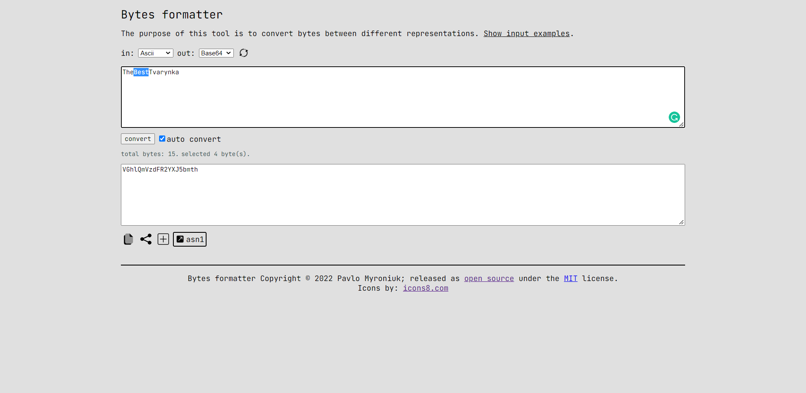

## bytes-formatter

Visit this tool at [bf.qkation.com](https://bf.qkation.com).

Converts bytes between different representations: hex, base64, decimal, ascii, etc.

Features:

* supported formats: `decimal`, `hex`, `base64`, `ascii`, `binary`, `utf-8`, and `utf-16`
* share by the link
* integrated [asn1 parser](https://lapo.it/asn1js/) (available for `hex` and `base64` output types)
* remembers current state

### Meta

Pavlo Myroniuk - [pspos.developqkation@gmail.com](mailto:pspos.developqkation@gmail.com).

Distributed under the [MIT](https://github.com/TheBestTvarynka/bytes-formatter/blob/main/LICENSE) license.

### Contributing

Feel free to contribute.

1. Fork it (<https://github.com/yourname/yourproject/fork>)
2. Create your feature branch (`git checkout -b feature/fooBar`)
3. Commit your changes (`git commit -am 'Add some fooBar'`)
4. Push to the branch (`git push origin feature/fooBar`)
5. Create a new Pull Request
